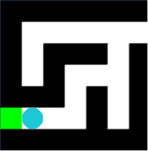
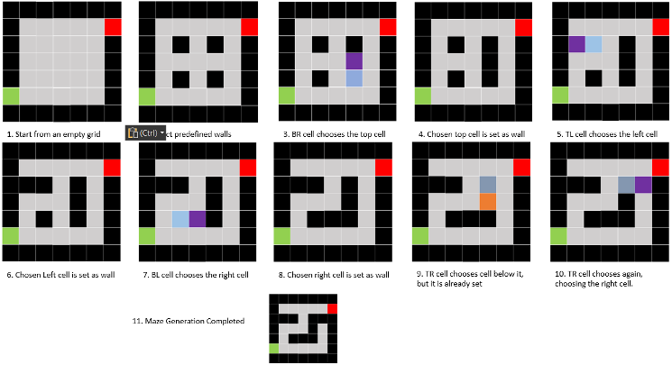

# Custom Maze Generation Algorithm

This Custom Algorithm in short, chooses a set of cells to be predefined as walls and randomly chooses a predefined wall and chooses the cell adjacent to it and fill it in as a wall. It chooses its predefined walls by choosing every alternate cell in both x and y axis. However, there are specific instances where the adjacent cell that a predefined wall chooses is already set as a wall by another predefined wall, 2 cells away from it. In this case, it will choose another adjacent cell again, until it can successfully set that cell as a wall.

 

A down-scaled sample diagram of how the algorithm runs in a 7x7 grid is shown in Figure 7.

The advantage of this algorithm is that it is rather straightforward to implement, and it generates a full maze blazingly fast, as it only had to iterate through the list of predefined wall cells, and choose a wall adjacent to it, which can run up to four times maximum.

However, it does have a possibility of setting "useless" chunks of walls, where 8 walls surround 1 path cell, which is obsolete. This is shown in Figure 8 and Figure 15. In addition, it also lacks variety in difficult to solve. Due to the random nature of picking a wall adjacent to the predefined wall, the algorithm generates mazes that could already have its solvability determined just by taking the right path at the early path journey.

The following table is the comparison in time taken to generate mazes on a 42*27 Grid.

| Algorithm | Time (rounded to 3 significant figures) |
|----------|----------|
| Custom	| 2.26 seconds |
| Eller’s | 3.36 seconds |
| Prim’s | 4.97 seconds |
| Random Depth First Traversal | 4.99 seconds |
| Random Traversal | 9.95 seconds |
| Wilson’s | ~200 seconds |
